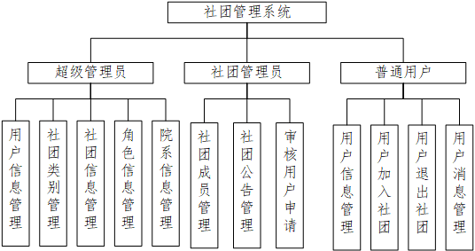
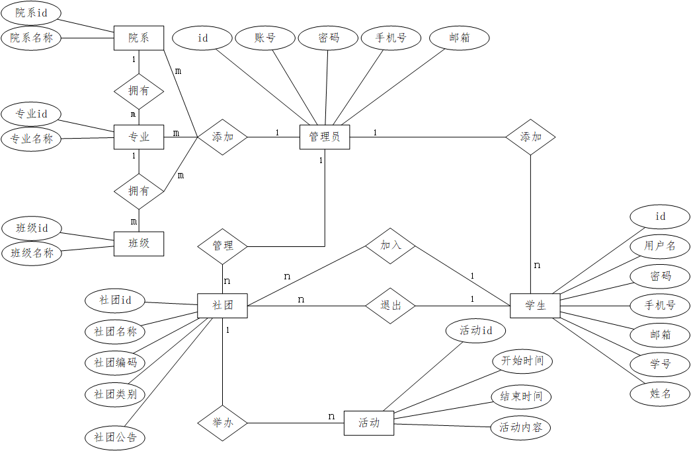
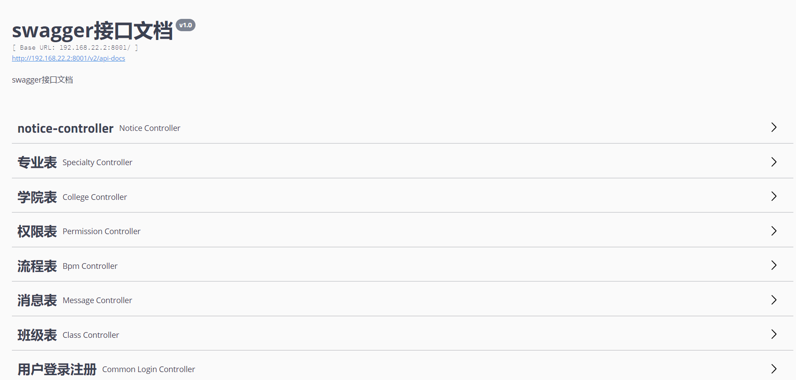
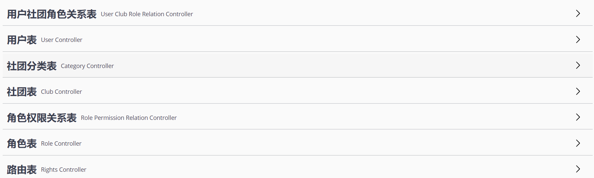
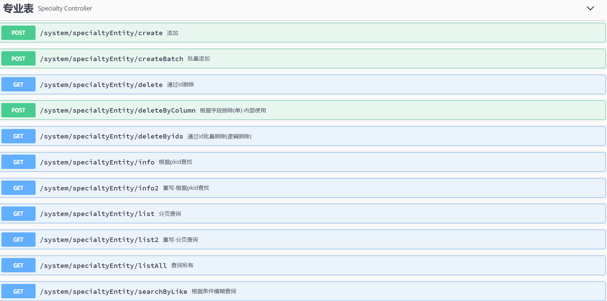
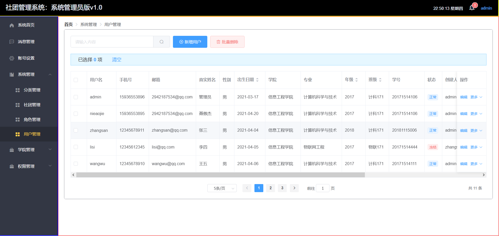
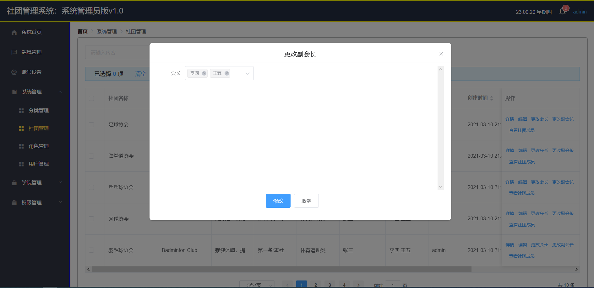
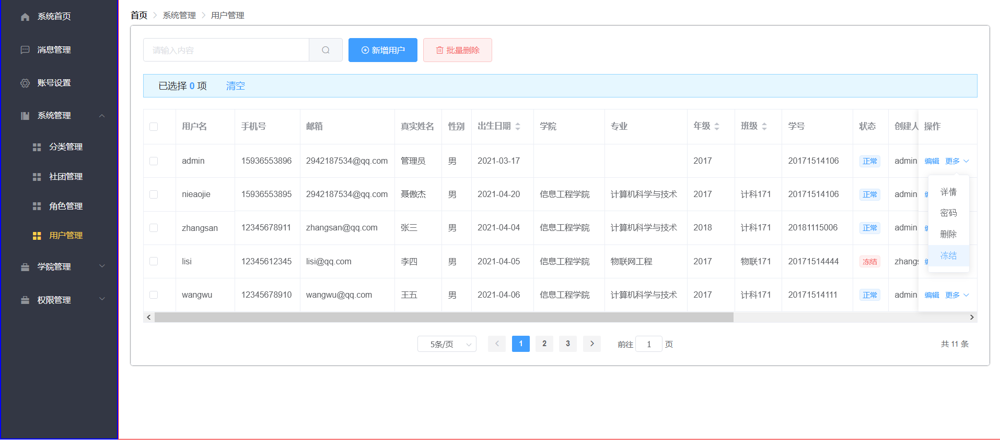
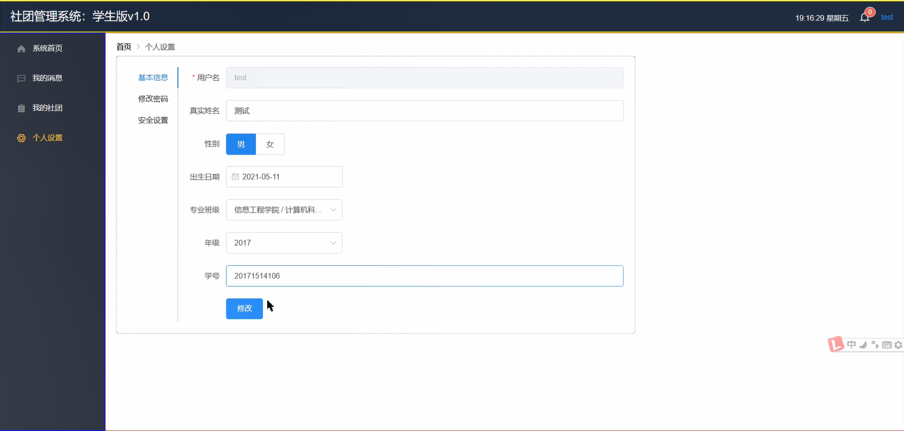
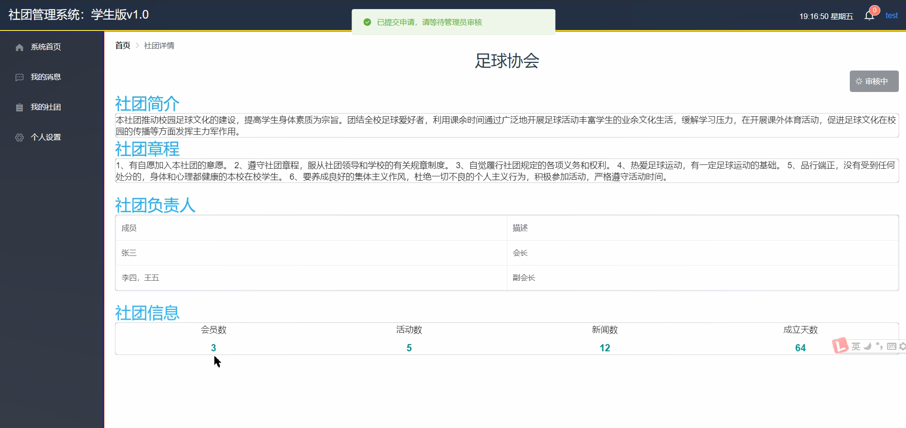

## 前端地址
https://github.com/nieaojie/student-club-management-web.git

## 系统介绍

该系统明确了社团成立的宗旨、社团的定位以及社团的组织结构，严格学生加入社团申请制度，明确社团活动举办流程和规范。使得学生通过阅读规范化的社团管理制度，注册并完善个人信息之后，可以浏览社团信息，加入自身感兴趣的社团，等待社团管理员审核通过之后，可以较为方便的查看社团发布的公告，参加社团举办的活动。

## 系统功能图

## ER图

## 技术架构

基于SpringBoot+SpringMVC+MyBatisPlus+Redis+Swagger+MySql+Vue.js+EmemetUI组件库前后的分离的项目。

## 项目接口文档

## **前端演示**

